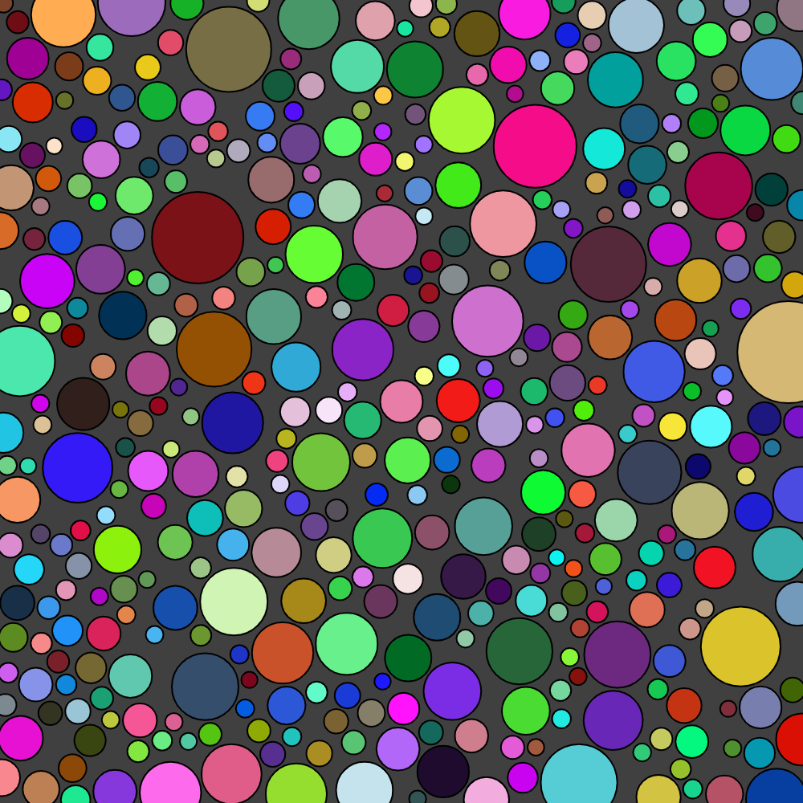
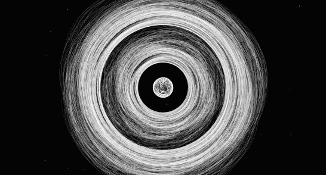
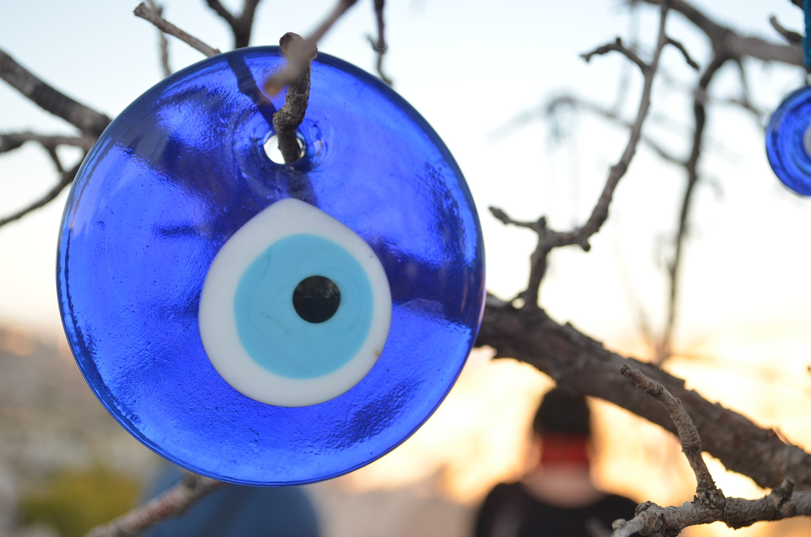
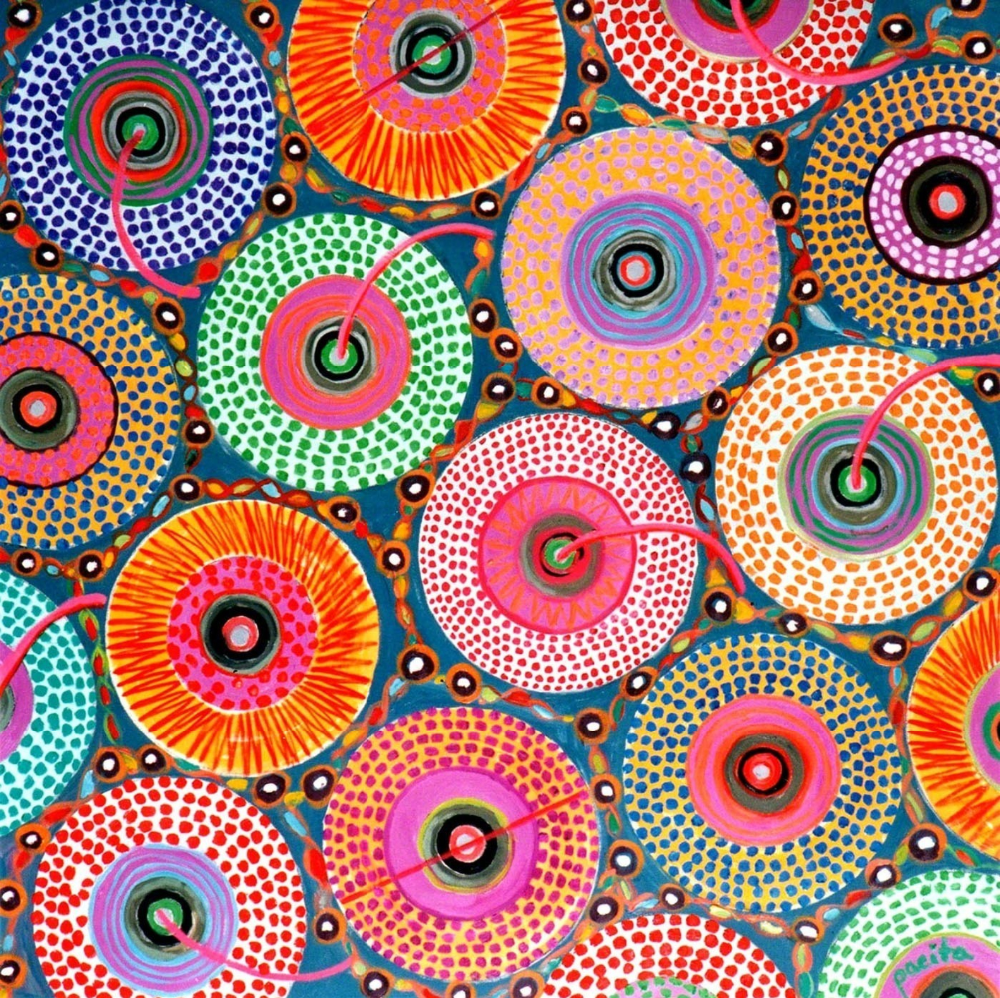

# IDEA9103 Creative Coding Major Assignment
## Instructions
1. Click anywhere on the welcome page to start the audio and artwork.
1. 5 audio tracks can be chosen by pressing number 1-5 on the keyboard.
1. Number 6 is the microphone input.
1. Press 'c' to regenerate the artwork.
1. Press spacebar to play or pause the audio.

## Details of the work
The chosen topic to animate this artwork is audio. Inspired by the artwork "Wheels of Fortune" by Pacita Abad, our group created a base code replicating the main feature of the piece. The primary technique used in constructing this generative art is "circle packing," where circles are randomly generated without overlapping or touching each other. This circle packing technique was implemented both in the base code and in this individual project. In the base code, the main circles are randomly generated without overlapping. However, due to size constraints (they must be large enough to visualise the pattern inside), a significant amount of empty space is left behind. In my individual design, I filled these gaps with smaller circles, referred to as bubbles in the code comments, which are also present in the original artwork. They also follow the circle packing algorithm and once generated they will continue to expand until their diameters touch the main circle or other bubbles. The small bubbles remind me of a Nazar, or the eye bead amulet. Animating it could bring the components to life.

For the chosen topic of audio, I incorporated both magnitude content and frequency content into the work. The magnitude (level) of the audio track is analysed through `amplitude.getLevel()`, and the frequency content is analysed through `FFT.analyze()`. The parameters modulated by audio content are as follows:

1. The diameter of the main circle is modulated by the magnitude of the track.
1. The background colour of the work is modulated by the magnitude of the track.
1. The diameter of the innermost circle of the bubble is modulated by the magnitude of a specific frequency band.
1. The fill colour of the innermost circle of the bubble is based on the specific frequency band. 
    - Points 3 and 4 can be distinctively visualised using a sine sweep in track 2.
1. The wave pattern surrounding the main circle is modulated through data analysed by `FFT.waveform()`, which obtains amplitude data along a brief time domain.

Although the primary inspiration stemmed from Pacita Abad's work, various components of the code were further influenced by other generative coding artists and tutorial videos. Occasionally, generative AI, primarily ChatGPT, was used as a guide to derive some complex logic in the code. Sections where generative AI was used are commented accordingly in the code.

## Inspirations and technical references

[Circle Packing 1](https://www.youtube.com/watch?v=yh1zsmoFCKQ)

[Circle Packing 2](https://happycoding.io/tutorials/p5js/creating-classes/circle-packing)

[Circle Packing 3](https://www.youtube.com/watch?v=QHEQuoIKgNE)

[p5js sound reference](https://p5js.org/reference/#/libraries/p5.sound)

[Saturn by Joe DeNavas](https://openprocessing.org/sketch/2132175)
